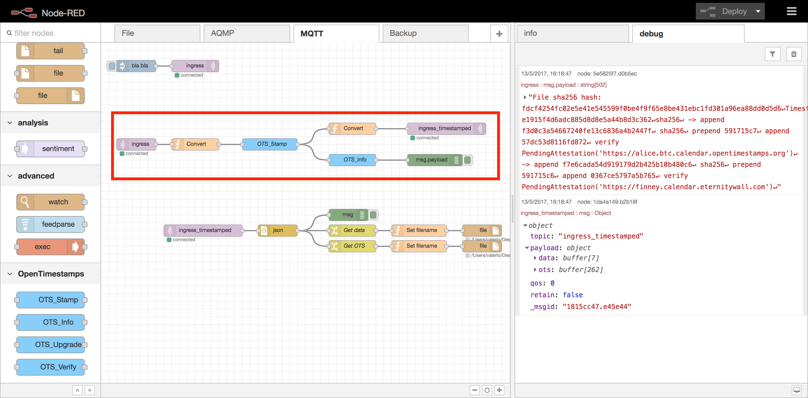
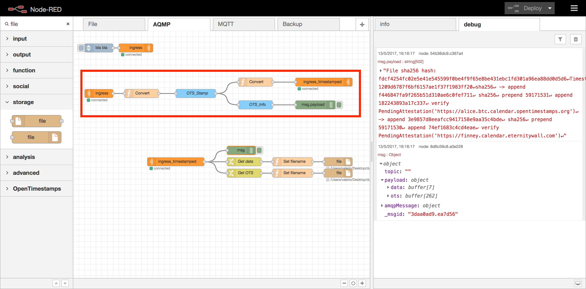

# node-red-contrib-opentimestamps
A collection of [Node-RED](http://nodered.org) nodes to read and emulate iBeacon tags with on board Bluetooth 4.0 radio or by using a cheap Bluetooth 4.0 USB adapter.

## What you mean with *opentimestamps*?

## Install
Use npm to command to install this package locally in the Node-RED modules directory
```bash
npm install node-red-contrib-opentimestamps
```
or install in it globally with the command
```bash
npm install node-red-contrib-opentimestamps -g
```

## Nodes included in the package
**OTS_Stamp** create an opentimestamps proof based on the data on buffer *msg.fileArray* and save the receipt on the buffer *msg.otsArray*

**OTS_Info** convert the opentimestamps receipt (taken from *msg.otsArray* ) in a readable format available on the *msg.payload* (as a string)

**OTS_Upgrade** upgrade the receipt available in the buffer *msg.otsArray* (overwrite the previous content)

**OTS_Verify** based on the two buffer *msg.fileArray* and *msg.otsArray* calculate if a message is valid or not and answer with the result in a readable format on *msg.payload*

## Usage example

A Simple usage of the plugin in Node-RED can be a message broker that work in the following way:

- receive a message from an input queue,
- request the timestamp for the payload and save the receipt from the opentimestamps server,
- create a new message with a JSON with the data of the oringinal payload and the receipt from opentimestamp server,
- send the message on the output queue.

### MQTT timestamping broker



The first implementation was a broker for timestamp messages flowing in a MQTT server, the flow of the broker is the part in the red box.

```json
[
    {
        "id": "86aec060.69b3d",
        "type": "inject",
        "z": "3c8a5604.39f8ba",
        "name": "",
        "topic": "",
        "payload": "bla bla",
        "payloadType": "str",
        "repeat": "",
        "crontab": "",
        "once": false,
        "x": 90,
        "y": 60,
        "wires": [
            [
                "10ea2927.96f247"
            ]
        ]
    },
    {
        "id": "3a768aaa.e483d6",
        "type": "OTS_Stamp",
        "z": "3c8a5604.39f8ba",
        "name": "OTS_Stamp",
        "x": 430,
        "y": 260,
        "wires": [
            [
                "2996139.6165bec",
                "208b34b.419b8cc"
            ]
        ]
    },
    {
        "id": "a8e88100.e5485",
        "type": "function",
        "z": "3c8a5604.39f8ba",
        "name": "Convert",
        "func": "msg.fileArray = new Buffer(msg.payload);\nmsg.payload = null;\nreturn msg;",
        "outputs": 1,
        "noerr": 0,
        "x": 240,
        "y": 260,
        "wires": [
            [
                "3a768aaa.e483d6"
            ]
        ]
    },
    {
        "id": "2996139.6165bec",
        "type": "OTS_Info",
        "z": "3c8a5604.39f8ba",
        "name": "OTS_Info",
        "x": 640,
        "y": 300,
        "wires": [
            [
                "5e5825f7.d0b5ec"
            ]
        ]
    },
    {
        "id": "5e5825f7.d0b5ec",
        "type": "debug",
        "z": "3c8a5604.39f8ba",
        "name": "",
        "active": true,
        "console": "false",
        "complete": "payload",
        "x": 850,
        "y": 300,
        "wires": []
    },
    {
        "id": "208b34b.419b8cc",
        "type": "function",
        "z": "3c8a5604.39f8ba",
        "name": "Convert",
        "func": "msg.payload = {}\nmsg.payload.data = msg.fileArray;\nmsg.payload.ots = msg.otsArray;\nreturn msg;",
        "outputs": 1,
        "noerr": 0,
        "x": 640,
        "y": 220,
        "wires": [
            [
                "911bbcd8.9ea6"
            ]
        ]
    },
    {
        "id": "630c703c.e22b5",
        "type": "mqtt in",
        "z": "3c8a5604.39f8ba",
        "name": "",
        "topic": "ingress_timestamped",
        "qos": "2",
        "broker": "b2e0c3ab.d24db",
        "x": 260,
        "y": 480,
        "wires": [
            [
                "8a4a0f7e.c5b8d"
            ]
        ]
    },
    {
        "id": "10ea2927.96f247",
        "type": "mqtt out",
        "z": "3c8a5604.39f8ba",
        "name": "",
        "topic": "ingress",
        "qos": "",
        "retain": "",
        "broker": "b2e0c3ab.d24db",
        "x": 240,
        "y": 60,
        "wires": []
    },
    {
        "id": "f6c25dc9.0707a",
        "type": "mqtt in",
        "z": "3c8a5604.39f8ba",
        "name": "",
        "topic": "ingress",
        "qos": "2",
        "broker": "b2e0c3ab.d24db",
        "x": 90,
        "y": 260,
        "wires": [
            [
                "a8e88100.e5485"
            ]
        ]
    },
    {
        "id": "911bbcd8.9ea6",
        "type": "mqtt out",
        "z": "3c8a5604.39f8ba",
        "name": "",
        "topic": "ingress_timestamped",
        "qos": "",
        "retain": "",
        "broker": "b2e0c3ab.d24db",
        "x": 880,
        "y": 220,
        "wires": []
    },
    {
        "id": "1da4a149.b2b18f",
        "type": "debug",
        "z": "3c8a5604.39f8ba",
        "name": "",
        "active": true,
        "console": "false",
        "complete": "true",
        "x": 630,
        "y": 440,
        "wires": []
    },
    {
        "id": "912c107d.aa1e7",
        "type": "change",
        "z": "3c8a5604.39f8ba",
        "name": "Get data",
        "rules": [
            {
                "t": "set",
                "p": "payload",
                "pt": "msg",
                "to": "payload.data",
                "tot": "msg"
            }
        ],
        "action": "",
        "property": "",
        "from": "",
        "to": "",
        "reg": false,
        "x": 640,
        "y": 480,
        "wires": [
            [
                "c5dc3887.176e88"
            ]
        ]
    },
    {
        "id": "1f918b60.31f315",
        "type": "change",
        "z": "3c8a5604.39f8ba",
        "name": "Get OTS",
        "rules": [
            {
                "t": "set",
                "p": "payload",
                "pt": "msg",
                "to": "payload.ots",
                "tot": "msg"
            }
        ],
        "action": "",
        "property": "",
        "from": "",
        "to": "",
        "reg": false,
        "x": 640,
        "y": 520,
        "wires": [
            [
                "1a0710d9.4f655f"
            ]
        ]
    },
    {
        "id": "c5dc3887.176e88",
        "type": "function",
        "z": "3c8a5604.39f8ba",
        "name": "Set filename",
        "func": "msg.filename = \"/opt/opentimestamp/dump-mqtt/\" + msg._msgid + \".data\"\nmsg.payload = new Buffer(msg.payload);\nreturn msg;",
        "outputs": 1,
        "noerr": 0,
        "x": 810,
        "y": 480,
        "wires": [
            [
                "7c6d470.33266b8"
            ]
        ]
    },
    {
        "id": "1a0710d9.4f655f",
        "type": "function",
        "z": "3c8a5604.39f8ba",
        "name": "Set filename",
        "func": "msg.filename = \"/opt/opentimestamp/dump-mqtt/\" + msg._msgid + \".ots\"\nmsg.payload = new Buffer(msg.payload);\nreturn msg;",
        "outputs": 1,
        "noerr": 0,
        "x": 810,
        "y": 520,
        "wires": [
            [
                "9b51894d.fb96c8"
            ]
        ]
    },
    {
        "id": "7c6d470.33266b8",
        "type": "file",
        "z": "3c8a5604.39f8ba",
        "name": "",
        "filename": "",
        "appendNewline": false,
        "createDir": false,
        "overwriteFile": "true",
        "x": 970,
        "y": 480,
        "wires": []
    },
    {
        "id": "9b51894d.fb96c8",
        "type": "file",
        "z": "3c8a5604.39f8ba",
        "name": "",
        "filename": "",
        "appendNewline": true,
        "createDir": false,
        "overwriteFile": "false",
        "x": 970,
        "y": 520,
        "wires": []
    },
    {
        "id": "8a4a0f7e.c5b8d",
        "type": "json",
        "z": "3c8a5604.39f8ba",
        "name": "",
        "x": 450,
        "y": 480,
        "wires": [
            [
                "1da4a149.b2b18f",
                "912c107d.aa1e7",
                "1f918b60.31f315"
            ]
        ]
    },
    {
        "id": "b2e0c3ab.d24db",
        "type": "mqtt-broker",
        "z": "",
        "broker": "test.mosquitto.org",
        "port": "1883",
        "clientid": "",
        "usetls": false,
        "compatmode": true,
        "keepalive": "60",
        "cleansession": true,
        "willTopic": "",
        "willQos": "0",
        "willPayload": "",
        "birthTopic": "",
        "birthQos": "0",
        "birthPayload": ""
    }
]

```
### AMQP timestamping broker



The same flow can be implemented using AMQP instead of MQTT with a similar flow.

```json
[
    {
        "id": "c96a6450.746888",
        "type": "inject",
        "z": "4392d5db.3b662c",
        "name": "",
        "topic": "",
        "payload": "bla bla",
        "payloadType": "str",
        "repeat": "",
        "crontab": "",
        "once": false,
        "x": 90,
        "y": 60,
        "wires": [
            [
                "d643a206.ef485"
            ]
        ]
    },
    {
        "id": "8d6c59c8.a0e228",
        "type": "debug",
        "z": "4392d5db.3b662c",
        "name": "",
        "active": true,
        "console": "false",
        "complete": "true",
        "x": 590,
        "y": 420,
        "wires": []
    },
    {
        "id": "58687119.21835",
        "type": "amqp in",
        "z": "4392d5db.3b662c",
        "name": "",
        "topic": "",
        "iotype": "1",
        "ioname": "ingress_timestamped",
        "server": "22c8fc1b.732854",
        "x": 360,
        "y": 460,
        "wires": [
            [
                "8d6c59c8.a0e228",
                "1fb75e0f.09efa2",
                "a9e5fe7f.6b618"
            ]
        ]
    },
    {
        "id": "d643a206.ef485",
        "type": "amqp out",
        "z": "4392d5db.3b662c",
        "name": "",
        "routingkey": "",
        "iotype": "1",
        "ioname": "ingress",
        "server": "22c8fc1b.732854",
        "x": 220,
        "y": 60,
        "wires": []
    },
    {
        "id": "66a83517.6b462c",
        "type": "amqp in",
        "z": "4392d5db.3b662c",
        "name": "",
        "topic": "",
        "iotype": "1",
        "ioname": "ingress",
        "server": "22c8fc1b.732854",
        "x": 90,
        "y": 220,
        "wires": [
            [
                "e5429fd6.1f08e"
            ]
        ]
    },
    {
        "id": "7874c67.2902b38",
        "type": "OTS_Stamp",
        "z": "4392d5db.3b662c",
        "name": "OTS_Stamp",
        "x": 430,
        "y": 220,
        "wires": [
            [
                "7468042d.a8bcdc",
                "2421d40d.cc059c"
            ]
        ]
    },
    {
        "id": "e5429fd6.1f08e",
        "type": "function",
        "z": "4392d5db.3b662c",
        "name": "Convert",
        "func": "msg.fileArray = new Buffer(msg.payload);\nmsg.payload = null;\nreturn msg;",
        "outputs": 1,
        "noerr": 0,
        "x": 240,
        "y": 220,
        "wires": [
            [
                "7874c67.2902b38"
            ]
        ]
    },
    {
        "id": "7468042d.a8bcdc",
        "type": "OTS_Info",
        "z": "4392d5db.3b662c",
        "name": "OTS_Info",
        "x": 640,
        "y": 260,
        "wires": [
            [
                "54b36dc9.c367a4"
            ]
        ]
    },
    {
        "id": "54b36dc9.c367a4",
        "type": "debug",
        "z": "4392d5db.3b662c",
        "name": "",
        "active": true,
        "console": "false",
        "complete": "payload",
        "x": 850,
        "y": 260,
        "wires": []
    },
    {
        "id": "2421d40d.cc059c",
        "type": "function",
        "z": "4392d5db.3b662c",
        "name": "Convert",
        "func": "msg.payload = {}\nmsg.payload.data = msg.fileArray;\nmsg.payload.ots = msg.otsArray;\nreturn msg;",
        "outputs": 1,
        "noerr": 0,
        "x": 640,
        "y": 180,
        "wires": [
            [
                "d0f7a135.d2704"
            ]
        ]
    },
    {
        "id": "d0f7a135.d2704",
        "type": "amqp out",
        "z": "4392d5db.3b662c",
        "name": "",
        "routingkey": "",
        "iotype": "1",
        "ioname": "ingress_timestamped",
        "server": "22c8fc1b.732854",
        "x": 880,
        "y": 180,
        "wires": []
    },
    {
        "id": "1fb75e0f.09efa2",
        "type": "change",
        "z": "4392d5db.3b662c",
        "name": "Get data",
        "rules": [
            {
                "t": "set",
                "p": "payload",
                "pt": "msg",
                "to": "payload.data",
                "tot": "msg"
            }
        ],
        "action": "",
        "property": "",
        "from": "",
        "to": "",
        "reg": false,
        "x": 600,
        "y": 460,
        "wires": [
            [
                "48d33270.bb3f0c"
            ]
        ]
    },
    {
        "id": "a9e5fe7f.6b618",
        "type": "change",
        "z": "4392d5db.3b662c",
        "name": "Get OTS",
        "rules": [
            {
                "t": "set",
                "p": "payload",
                "pt": "msg",
                "to": "payload.ots",
                "tot": "msg"
            }
        ],
        "action": "",
        "property": "",
        "from": "",
        "to": "",
        "reg": false,
        "x": 600,
        "y": 500,
        "wires": [
            [
                "9b07c36e.453f1"
            ]
        ]
    },
    {
        "id": "48d33270.bb3f0c",
        "type": "function",
        "z": "4392d5db.3b662c",
        "name": "Set filename",
        "func": "msg.filename = \"/opt/opentimestamp/dump-amqp/\" + msg._msgid + \".data\"\nmsg.payload = new Buffer(msg.payload);\nreturn msg;",
        "outputs": 1,
        "noerr": 0,
        "x": 770,
        "y": 460,
        "wires": [
            [
                "b4cdc2a6.e6399"
            ]
        ]
    },
    {
        "id": "9b07c36e.453f1",
        "type": "function",
        "z": "4392d5db.3b662c",
        "name": "Set filename",
        "func": "msg.filename = \"/opt/opentimestamp/dump-amqp/\" + msg._msgid + \".ots\"\nmsg.payload = new Buffer(msg.payload);\nreturn msg",
        "outputs": 1,
        "noerr": 0,
        "x": 770,
        "y": 500,
        "wires": [
            [
                "c56635e0.1f9568"
            ]
        ]
    },
    {
        "id": "b4cdc2a6.e6399",
        "type": "file",
        "z": "4392d5db.3b662c",
        "name": "",
        "filename": "",
        "appendNewline": false,
        "createDir": false,
        "overwriteFile": "true",
        "x": 930,
        "y": 460,
        "wires": []
    },
    {
        "id": "c56635e0.1f9568",
        "type": "file",
        "z": "4392d5db.3b662c",
        "name": "",
        "filename": "",
        "appendNewline": true,
        "createDir": false,
        "overwriteFile": "false",
        "x": 930,
        "y": 500,
        "wires": []
    },
    {
        "id": "22c8fc1b.732854",
        "type": "amqp-server",
        "z": "",
        "host": "mqtt-broker",
        "port": "5672",
        "vhost": "",
        "keepalive": "30",
        "usetls": false,
        "verifyservercert": true,
        "usetopology": false,
        "topology": "{\n\t\"exchanges\": [\n\t\t{\"name\": \"exchange1\", \"type\": \"direct\", \"options\": {\"durable\": false}},\n\t\t{\"name\": \"exchange2\"}\n\t],\n\t\"queues\": [\n\t\t{\"name\": \"queue1\", \"options\": {\"messageTtl\": 60000}},\n\t\t{\"name\": \"queue2\"}\n\t],\n\t\"bindings\": [\n\t\t{\"source\": \"exchange1\", \"queue\": \"queue1\", \"pattern\": \"debug\", \"args\": {}},\n\t\t{\"source\": \"exchange1\", \"exchange\": \"exchange2\", \"pattern\": \"error\"},\n\t\t{\"source\": \"exchange2\", \"queue\": \"queue2\"}\n\t]\n}"
    }
]

```

## History
- 0.0.2 - 17 May 2017 : First documented version, public available
- 0.0.1 - 15 May 2017 : Initial release developed during the event [Hackathon - building layer2 applications that matter](https://www.eventbrite.com/e/bitcoin-building-layer2-applications-that-matter-tickets-33392316317#)

Video of the Hackathon available on [YouTube](https://www.youtube.com/watch?v=0O_IaCiG3DY) DANGER! It's in Italian! :(

## Authors
* Valerio Vaccaro (https://github.com/valerio-vaccaro)

## Credits
Node-RED has been made possible by the hard work of Nick O'Leary @knolleary and Dave Conway-Jones @ceejay at IBM Emerging Technology. Much thanks to them and other supporters for advancing this platform.
These node use the javascript-opentimestamps library and the opentimestamps public server! Thanks a lot to make it free and open.

This module is developed by Valerio Vaccaro (http://www.valeriovaccaro.it).
